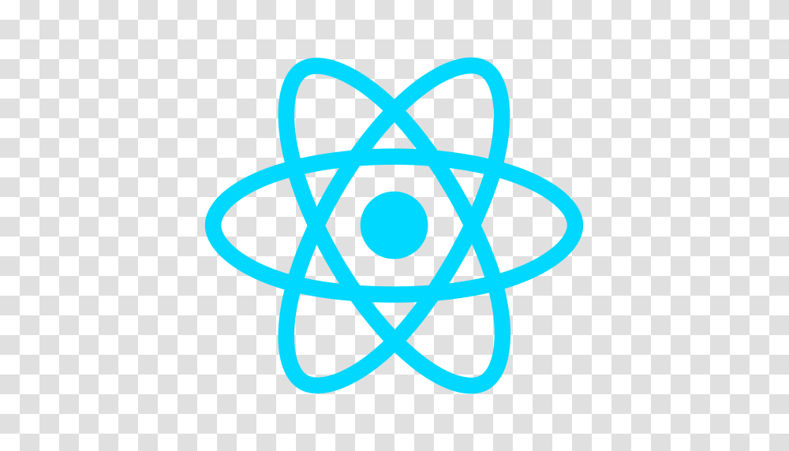
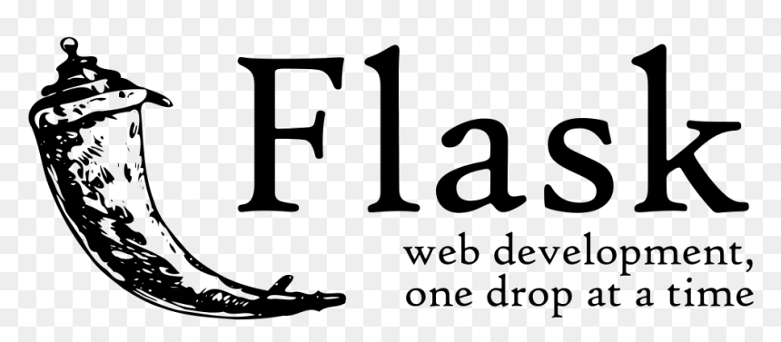
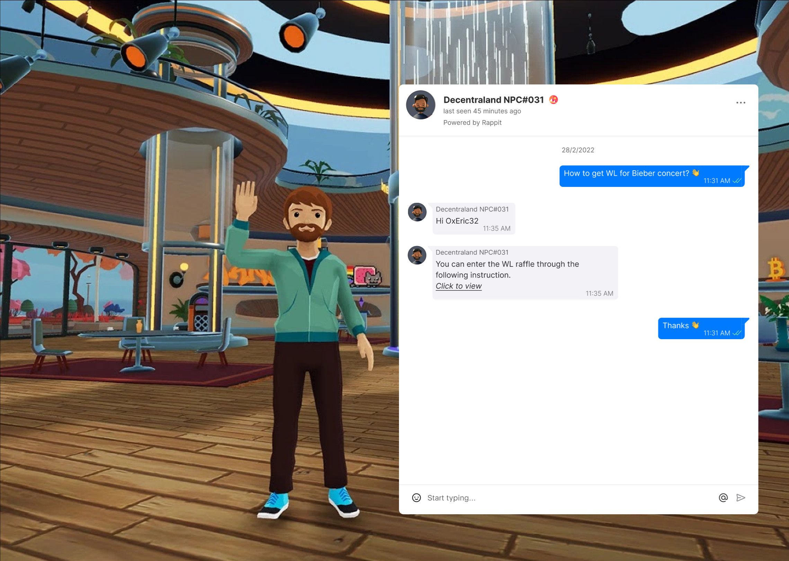
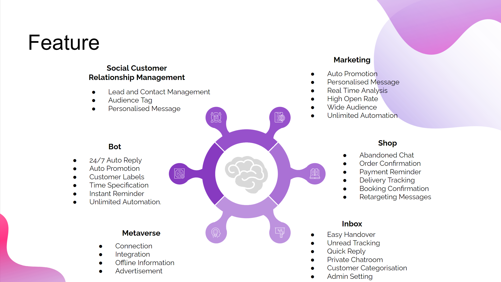

# Rappit 

The All-In-One Data Exchange Hub Across The World & Metaverse 

## Goal
               
- Connect between Metaverse and Real World for Customer Services
- Provide Metaverse/ Platform Supports
- Provide Tools for brand new market channel

## Project Structure

<table>
  <tr>
	  <td>Metaverse - Roblox</td>
	  <td>Frontend - React</td>
	  <td>Backend - Python Flask</td>
  </tr>
  <tr>
	  <td valign="middle">
	  <td valign="middle">
	  <td valign="middle">
</table>

## Design
<table>
  <tr>
	  <td>Design User Interface 1</td>
	  <td>Design User Interface 2</td>
  </tr>
  <tr>
	  <td valign="top">
	  <td valign="top">
</table>

<table>
  <tr>
	 <td>New generation of platform </td>
	 <td>Centralised Metaverse Twins</td>
	 <td>All-in-One e-Marketing Platform</td>
	 
  </tr>
  <tr>
    <td valign="top"></td>
    <td valign="top"></td>
    <td valign="top"></td>
  </tr>
<table>

## Proposed Features

## Showcase

	
	
## UI Design Prototype
	
Prototype created by Figma here:
  
https://www.figma.com/file/xAYU3f60DOKEqnng3QIKs0/UI?node-id=0%3A1
	
## Preproject brainstorm
	
Preproject brainstorm here:
  
https://www.figma.com/file/BR45q2QY2ViAaMXsOhp159Nc/Rappit?node-id=0%3A1

## Demonstation Video
	
Demonstration Video here:

## Idea In General

Powerpoint here:
  https://docs.google.com/presentation/d/1l8v45GcObOTRRHviZaKyBL6G_FLayuPiRhx6TN0350M/edit?usp=sharing
