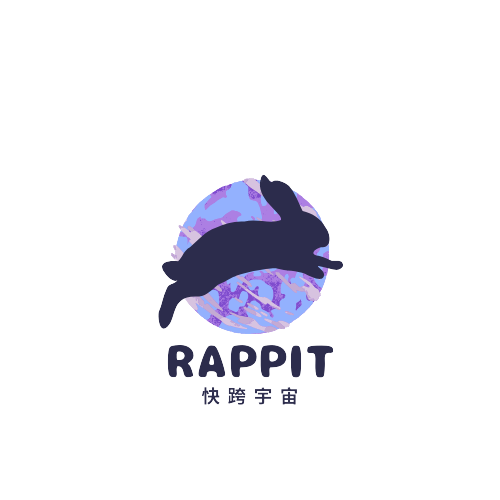
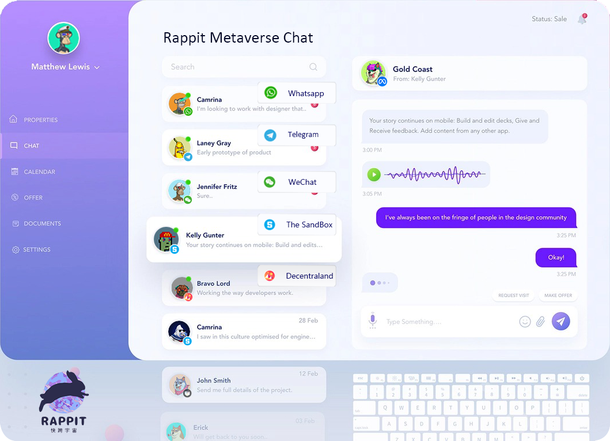
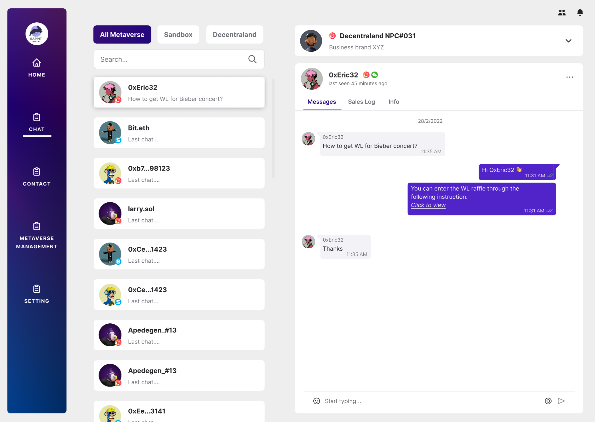
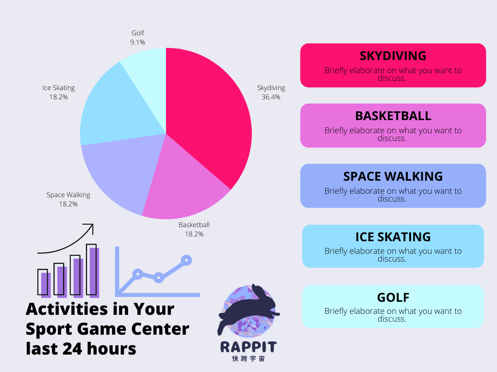
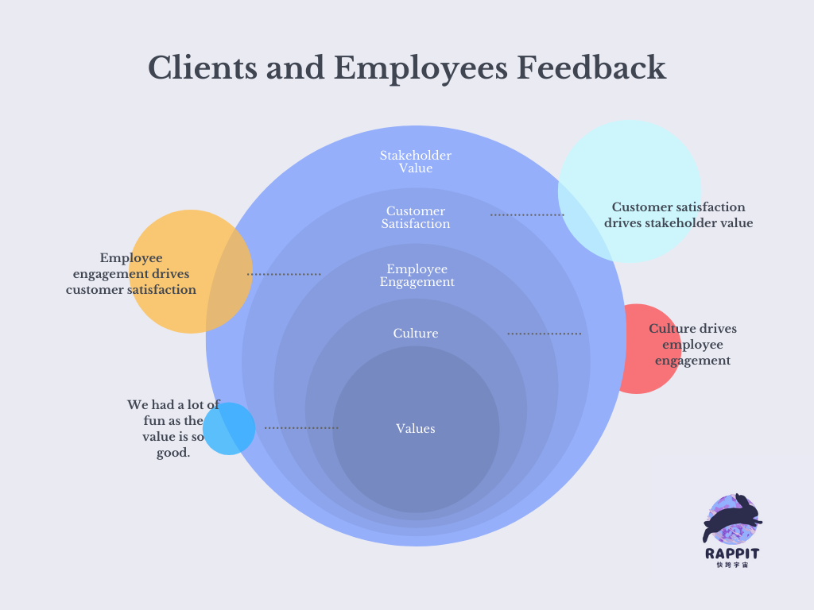
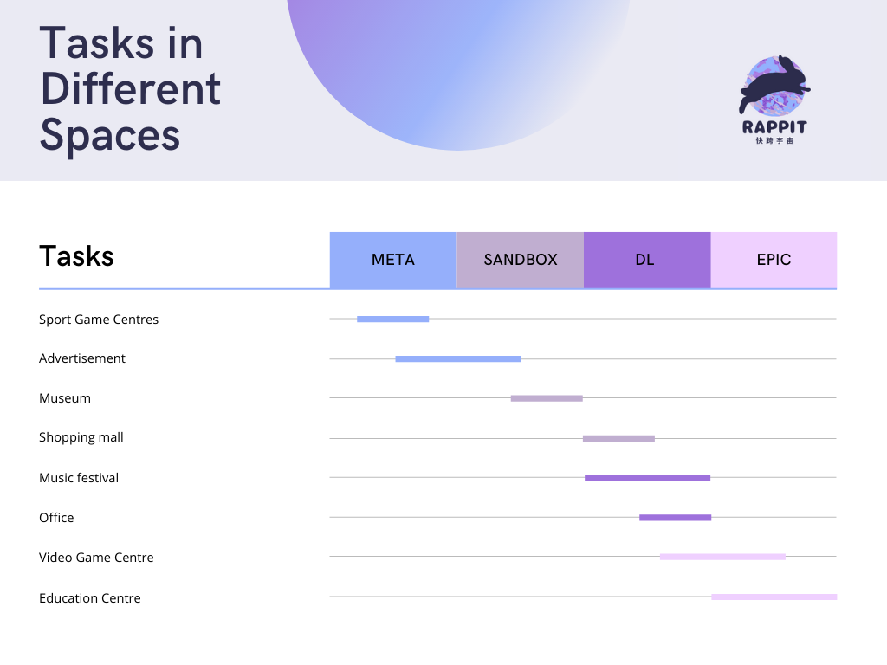

# Rappit

The All-In-One Data Exchange Hub Across The World & Metaverse 

<table>
  <tr>
	 <td>Design User Interface 1</td>
	 <td>Design User Interface 2</td>
  </tr>
  <tr>
	 <td valign="top">
	 <td valign="top">
  </tr>
</table>

<table>
  <tr>
	 <td>Features 1</td>
	 <td>Features 2</td>
	 <td>Features 3</td>
	 
  </tr>
  <tr>
    <td valign="top"></td>
    <td valign="top"></td>
    <td valign="top"></td>
  </tr>
<table>

-------------------------------------------------------
You can see the prototype created by Figma here
  
https://www.figma.com/file/BR45q2QY2ViAaMXsOhp159Nc/Rappit?node-id=0%3A1
  
-------------------------------------------------------
Here is out preproject brainstorm
  
-------------------------------------------------------
Here is the video we made!
  
-------------------------------------------------------
 
  
 
